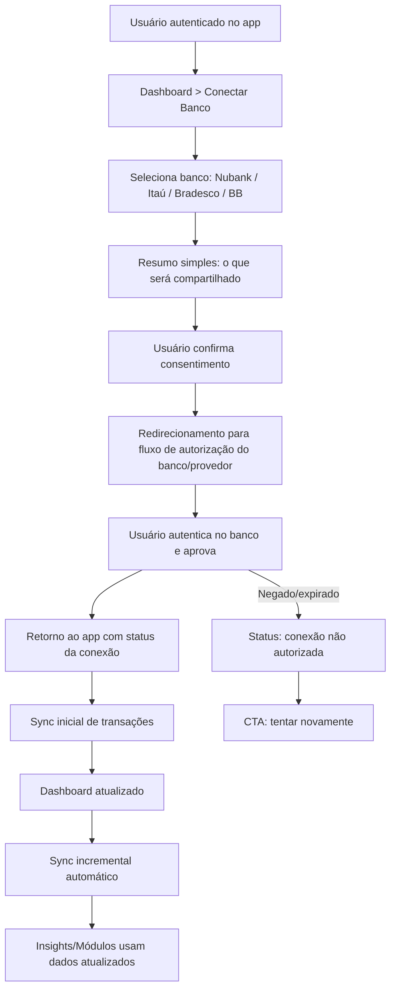
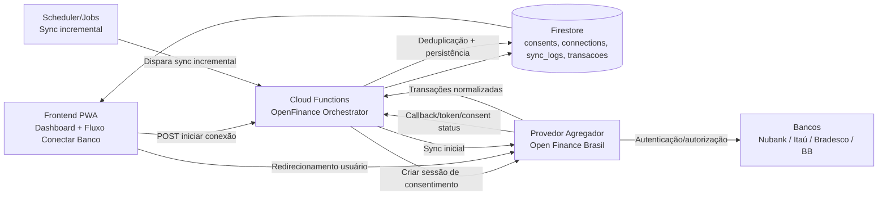
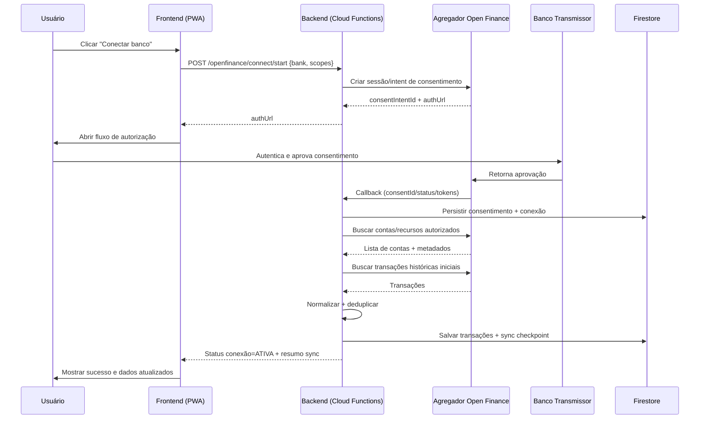
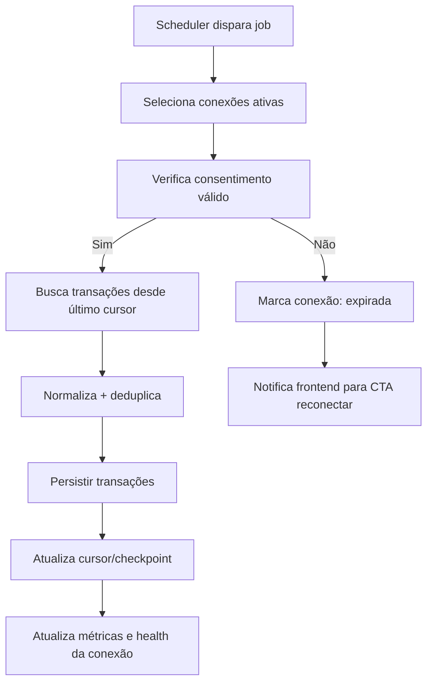
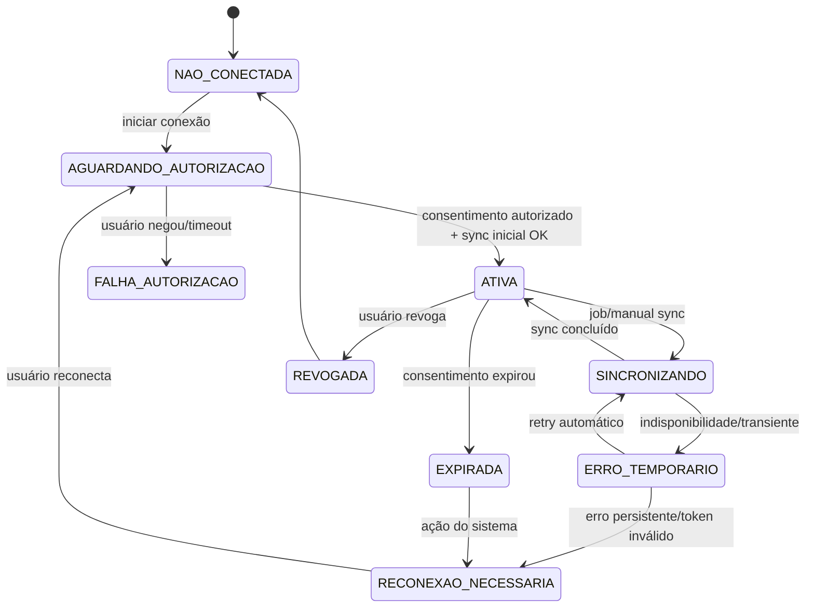
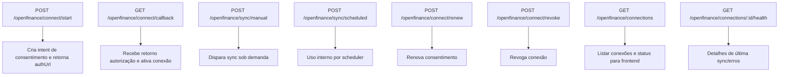
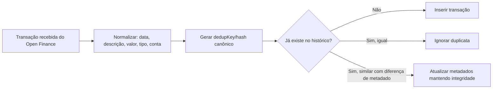

# Fluxo Open Finance — Jornada do Cliente + Arquitetura Interna

Este documento descreve o fluxo ponta a ponta da integração Open Finance para o Smart Finance IA, cobrindo:

1. Jornada do usuário (UX)
2. Fluxo técnico de endpoints e integrações
3. Ciclo de vida de consentimento
4. Sincronização de transações e deduplicação
5. Tratamento de erros e reconexão

---

## 1) Jornada do cliente (alto nível)



---

## 2) Arquitetura técnica (componentes)



---

## 3) Sequência detalhada (conectar + sync inicial)



---

## 4) Fluxo de sincronização incremental



---

## 5) Estados de conexão (UX + backend)



---

## 6) Endpoints sugeridos (backend)



---

## 7) Regras de deduplicação e reconciliação



---

## 8) UX de erro e recuperação (mensagens acionáveis)

```mermaid
flowchart TD
    A[Erro de sincronização] --> B{Tipo de erro}
    B -->|Consentimento expirado| C[Mostrar: "Conexão expirou" + botão Reconectar]
    B -->|Banco indisponível| D[Mostrar: "Banco indisponível no momento" + tentar novamente]
    B -->|Falha temporária rede| E[Retry automático + feedback não intrusivo]
    B -->|Permissão insuficiente| F[Mostrar: "Aprovação incompleta" + refazer conexão]
    C --> G[Fluxo reconexão]
    D --> H[Nova tentativa manual]
    E --> I[Recuperação automática]
    F --> G
```

---

## 9) Observações de produto

1. Para MVP com menor fricção, priorizar agregador com cobertura dos bancos alvo.
2. Manter contrato interno desacoplado para troca de provedor sem quebrar frontend.
3. Tratar Open Finance como fonte contínua de dados (não evento único de importação).
4. Toda comunicação com usuário deve privilegiar clareza e ação imediata.
