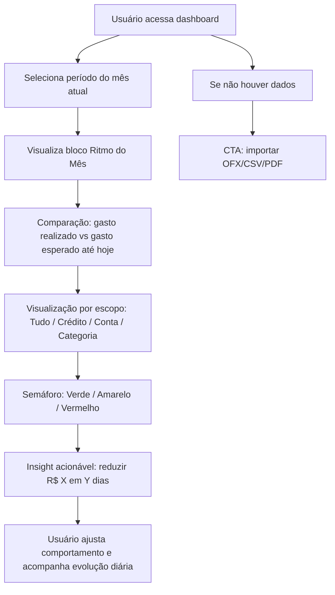
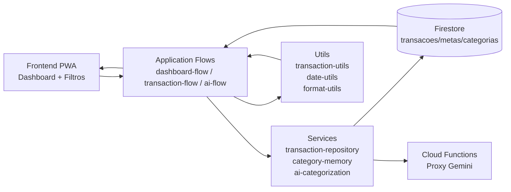
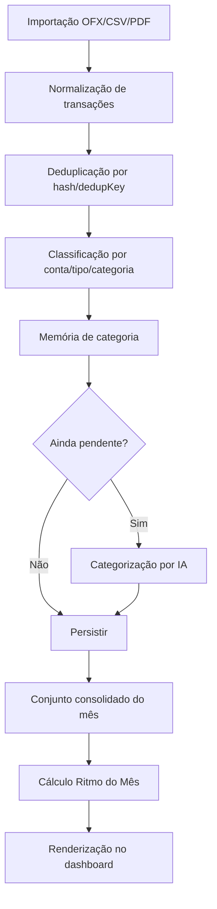
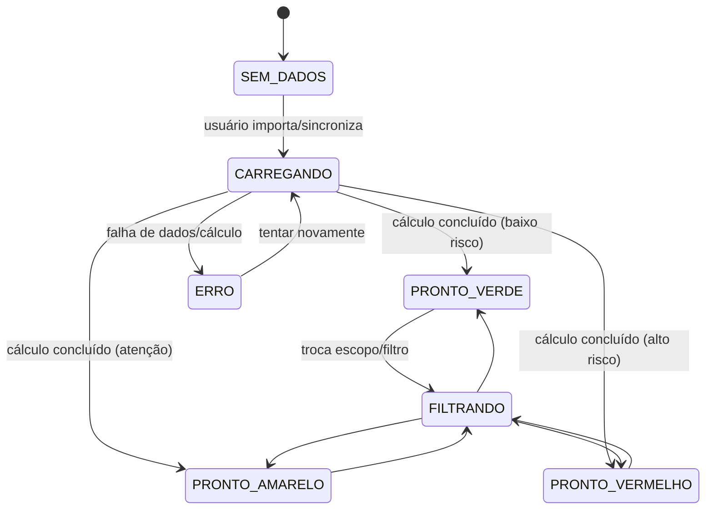
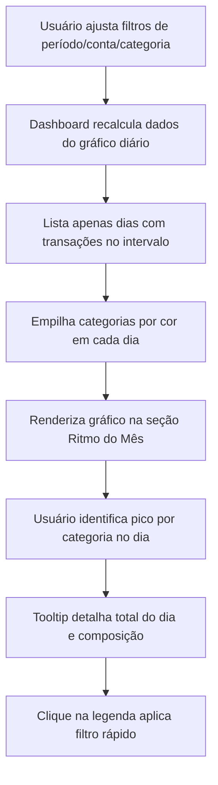
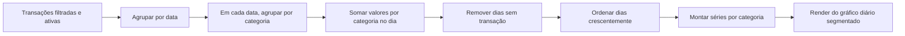
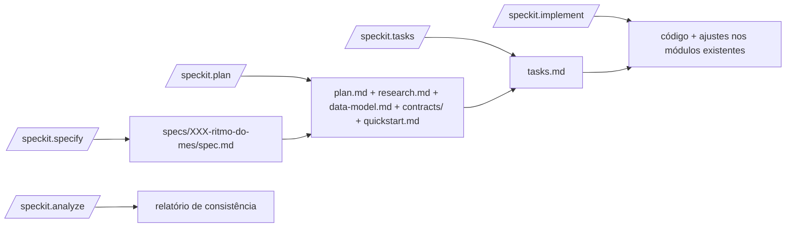
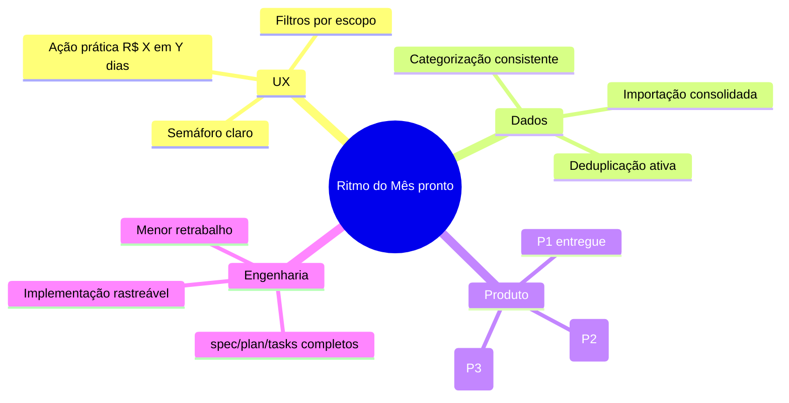

# Fluxo Ritmo do Mês — Jornada do Cliente + Arquitetura + Execução Speckit

Este documento detalha o fluxo completo da abordagem 1 (`apresentacao_speckit_1.md`) para a feature **Ritmo do Mês**, cobrindo:

1. Jornada do usuário (UX)
2. Pipeline técnico de dados (importação, categorização, consolidação)
3. Cálculo do ritmo e semáforo
4. Geração de ação prática (reduzir R$ X em Y dias)
5. Nova sessão: gráfico diário por categoria (foco em leitura rápida)
6. Fluxo de execução Speckit (do constitution ao implement)

---

## 1) Jornada do cliente (alto nível)



---

## 2) Arquitetura técnica (componentes atuais do app)



---

## 3) Pipeline de dados para alimentar Ritmo do Mês



---

## 4) Cálculo do Ritmo do Mês (lógica funcional)

```mermaid
flowchart TD
    A[Entrada: transações ativas do mês] --> B[Filtrar por escopo\nTudo/Crédito/Conta/Categoria]
    B --> C[Somar gasto realizado até hoje]
    C --> D[Obter orçamento/meta mensal do escopo]
    D --> E[Calcular gasto esperado até hoje\nmeta_mensal * (dia_atual / total_dias_mes)]
    E --> F[Comparar realizado vs esperado]
    F --> G{Faixa de risco}
    G -->|<= esperado| H[Verde: dentro do ritmo]
    G -->|levemente acima| I[Amarelo: atenção]
    G -->|bem acima| J[Vermelho: acima do ritmo]
    H --> K[Gerar recomendação]
    I --> K
    J --> K
```

---

## 5) Cálculo da recomendação prática (R$ X em Y dias)

```mermaid
flowchart LR
    A[Meta mensal do escopo] --> B[Realizado até hoje]
    B --> C[Saldo disponível para o mês\nmeta - realizado]
    C --> D[Dias restantes no mês = Y]
    D --> E[Orçamento diário recomendado restante]
    E --> F[Gap para voltar ao alvo = X]
    F --> G[Mensagem: "Para fechar no alvo, reduza R$ X em Y dias"]
```

---

## 6) Estados de UI do módulo Ritmo do Mês



---

## 7) Nova sessão UX — Gráfico de gastos por dia e categoria

Objetivo da sessão: permitir leitura rápida de **qual categoria mais pesou em cada dia** no período filtrado.

Regras funcionais da sessão:

1. O gráfico considera **todo o intervalo filtrado** na página.
2. O eixo X deve exibir **somente dias com ao menos 1 transação**.
3. Cada barra diária é segmentada por categoria (cores fixas por categoria).
4. Tooltip do dia mostra:
   - total do dia,
   - ranking de categorias do dia,
   - percentual por categoria no dia.
5. Clique/toque em uma cor da legenda aplica filtro rápido por categoria na listagem.

### 7.1 Fluxo da experiência da nova sessão



### 7.2 Pipeline de agregação para o gráfico diário



### 7.3 Exemplo visual (dias com transação apenas)

> Exemplo ilustrativo com período filtrado em que só houve gasto nos dias 02, 03, 05, 08 e 11.

```mermaid
xychart-beta
    title "Gastos por dia (segmentado por categoria)"
    x-axis [02, 03, 05, 08, 11]
    y-axis "R$" 0 --> 700
    bar "Alimentação" [120, 90, 220, 140, 110]
    bar "Transporte" [60, 30, 50, 80, 40]
    bar "Lazer" [0, 70, 90, 20, 130]
    bar "Moradia" [300, 0, 0, 300, 0]
```



---

## 8) Fluxo Speckit (abordagem 1) para entregar a feature

```mermaid
flowchart TD
    A[/speckit.constitution] --> B[/speckit.specify]
    B --> C[/speckit.clarify opcional]
    C --> D[/speckit.plan]
    D --> E[/speckit.checklist opcional]
    E --> F[/speckit.tasks]
    F --> G[/speckit.analyze opcional]
    G --> H[/speckit.implement]
    H --> I[Validação final\n(testes + revisão + PR)]
```

---

## 9) Fluxo de artefatos gerados no Speckit



---

## 10) Resultado esperado ao final


